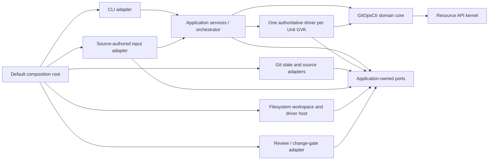

# Ports and adapters architecture

Status: proposed high-level direction. The names and exact Python interfaces in
this document are intentionally provisional. The architectural boundaries and
invariants are the contract to preserve while the interfaces are refined.

## Intent

gitopsctr has two inner semantic layers. A small resource API kernel describes
versioned kinds, document contracts, families, identities, addresses, and
relationship topology without knowing the GitOpsCtr product domain. The
GitOpsCtr domain core builds its source/desired/observed resource model and safe
state transitions on that kernel. Neither layer depends on Git, a filesystem,
YAML, a forge, or a particular source-authoring workflow.

Git is the first implementation because it is a good fit for immutable state,
review, audit history, and compare-and-swap publication; it is not part of
either semantic layer.

The shipped application will initially have one fixed composition:

- source-authored YAML or JSON input;
- Git-backed source, desired, and observed snapshots;
- Git-backed publication, retention, and fencing;
- filesystem materialization for the existing Unit drivers;
- the currently supported review/change-gate integration.

This composition is assembled in one central place and is not runtime
configurable. The CLI delegates to an injected orchestrator and does not know
which implementations were selected.

The goal is not to build a backend plugin framework or publish a generic
resource framework in advance. The goal is to make both semantic layers
complete in terms of the guarantees they require, and to make the Git
implementation satisfy the application guarantees through explicit ports.

## Target architecture



Dependencies point inward:

1. The resource API kernel depends only on library-neutral API and document
   primitives. It has no GitOpsCtr domain, application, workspace, adapter,
   driver, entry-point loader, or CLI dependency.
2. The pure GitOpsCtr domain depends on the resource API kernel but has no
   dependency on application services, workspaces, adapters, or the CLI. It
   validates and transforms GitOpsCtr domain values.
3. Application services depend on the GitOpsCtr domain and own the outgoing port
   protocols needed to coordinate complete use cases.
4. A Unit driver is a uniquely registered application extension. Its API
   models and pure validation are visible to the GitOpsCtr catalog, while its
   effectful implementation runs at the application boundary through
   application-owned, domain-typed driver contexts and capabilities.
5. Adapters implement ports and translate implementation concepts into domain
   values.
6. A composition root constructs the adapters and injects them into the
   application services.
7. The CLI constructs command intents, calls the application services, and
   renders typed results.

There must be no service locator or process-global cached backend hidden inside
the kernel, domain, or orchestration layers.

## Resource API kernel

The resource API kernel is independent of GitOpsCtr's domain. It owns only the
machinery needed to define and validate a versioned resource API:

- `GVK`, `ApiKind`, and exactly one authoritative registration per GVK;
- JSON value, document-contract, and typed-document-contract interfaces;
- family names, selectors, aliases, and API-kind membership;
- family-local identities, selections, canonical qualified names, and
  root/child/mirror addressing protocols;
- generic named directed relationship topology between families;
- registry contribution merging and structural validation, including GVK and
  selector collisions, ambiguous family membership, missing endpoints,
  addressing cycles, and canonical parse/render round trips.

The kernel accepts registrations and contributions supplied by its caller. It
does not load `gitopsctr.apis` entry points, discover documents, choose a
storage layout, render CLI output, or know how a relationship is authenticated
from a GitOpsCtr document.

Relationship topology in the kernel says only that a named directed edge joins
two families and can participate in addressing. Observation freshness,
Artifact production, Stack ownership, cardinality, exact-incarnation fences,
and binding logic remain GitOpsCtr semantics layered onto those edges.

The kernel does not generalize GitOpsCtr's current ontology into configurable
type parameters. In particular, source/desired/observed planes,
Project/Environment scopes, placements, contract profiles, collections, and a
single Environment namespace rule do not belong in the kernel.

This begins as an internal `gitopsctr.resource_api` package with a strict import
boundary. It should become a separately distributed library only after a
second real consumer demonstrates that the API is stable and that the apparent
abstractions are genuinely shared.

## GitOpsCtr domain core

The GitOpsCtr domain core instantiates the resource API kernel and owns the
concepts whose meaning does not change when a storage or source implementation
changes:

- source, desired, and observed planes;
- Project and Environment scopes and the Environment namespace boundary;
- family placements, contract profiles, logical collections, and the built-in
  catalog;
- Unit, Stack, StackTemplate, Promotion, Receipt, and Artifact semantics;
- observations, Artifact descriptions, Stack ownership, and their executable
  relationship bindings;
- inspection view semantics and derived relationship summaries;
- StackTemplate expansion and Stack projection;
- desired and observed resource graph validation;
- pure transition plans and policies for apply, promotion, convergence,
  rollback, and deletion;
- reconciliation eligibility and dependency ordering;
- exact-incarnation, evidence, ownership, and effect-fencing rules;
- typed operation errors and outcomes.

The current combined `ResourceRegistry` therefore separates into a generic
resource API registry and a GitOpsCtr resource catalog layered on top. The
existing `build_resource_registry()` remains a GitOpsCtr composition function:
it supplies built-in families, domain relationships, placements, inspection
views, and installed contributions to the kernel rather than becoming kernel
code. Table/YAML/JSON presenters remain application and CLI concerns.

The installed contribution API remains GitOpsCtr-facing. The default
composition may split one contribution internally into kernel registrations
and GitOpsCtr catalog decorations, but plugins are not asked to assemble the
kernel directly and this extraction does not create a second public plugin
surface.

The domain should operate on opaque values such as `SnapshotId`, `ContentId`,
`EnvironmentId`, `AuthorityObservation`, `ChannelId`, `HeadObservation`,
`SourceId`, and `SourceSnapshotId`. Their equality and canonical serialization
matter; a forty-character Git commit, Git blob ID, branch name, or filesystem
path must not be assumed.

These identities have different meanings:

- `ContentId` identifies exact logical content and is deterministic over the
  canonical content it describes.
- `SnapshotId` identifies one immutable state version and may include lineage
  or publication metadata. Equal content does not require equal snapshot IDs.
- `HeadObservation` identifies one observed incarnation of a mutable channel
  head, including observed absence. It is the compare-and-swap and cleanup
  fence, so an `A -> B -> A` channel sequence cannot be mistaken for an
  unchanged head.
- `AuthorityObservation` identifies the trusted Environment-to-channel and
  policy mapping used to authorize an operation. A configuration remap cannot
  silently preserve an old authorization just because the old channel head is
  unchanged.

The core may require capabilities such as ancestry or atomic ownership. A
backend that cannot provide a required capability must reject the operation or
be rejected by the composition root. It must never silently weaken the domain
guarantee.

## Application services and incoming port

The primary incoming port is an `Orchestrator`-like application API. It exposes
the product's use cases as typed commands and results, for example:

- apply an authored change set;
- promote between environments;
- reconcile or converge selected resources;
- inspect a snapshot;
- roll back by publishing a new forward snapshot;
- request and progress deletion;
- validate authored or persisted resources.

The application layer coordinates domain transitions and outgoing ports. It
does not parse command-line arguments, render tables, discover a Git
repository, execute Git commands, manipulate filesystem trees, or know that a
review gate is implemented by a pull request.

The CLI is one incoming adapter. A future API or controller daemon could call
the same application services without recreating orchestration logic.

## Outgoing ports

The ports should model required behavior rather than mirror the current
`GitStateStore` method list. Exact protocol boundaries may be refined as the
migration exposes transactional coupling.

### Deployment authority

The deployment authority is the trusted control-plane boundary for an
Environment. It identifies the accepted desired and observed channels and the
policies that govern publication, review, and effect fencing. It must be
resolved independently of the desired, candidate, or historical snapshot being
operated on; persisted state may describe execution, but it cannot declare
itself accepted.

Resolving the live desired channel produces an unforgeable
`AcceptedDesiredSnapshot` containing its `EnvironmentId`, issuer and exact
`AuthorityObservation`, `ChannelId`, `HeadObservation`, and `SnapshotId`.
Reconciliation, teardown, post-effect completion, and destructive cleanup
require this value. It cannot be reused for another Environment that happens to
share a channel. The authority mapping and accepted head are revalidated before
effect acquisition and again before post-effect completion. Inspection and
planning may use an ordinary current, historical, or candidate snapshot.

The default source-authored composition may obtain this authority from trusted
Project and Environment configuration, but the trust decision and physical
configuration location belong to the adapter and composition boundary.

### Snapshot store

The snapshot store provides the state-plane semantics used for desired and
observed state:

- resolve a channel to an exact `HeadObservation`, including absence;
- open a current, historical, or explicitly pinned immutable snapshot;
- expose stable content identities for documents or logical keys;
- determine lineage when an operation requires it;
- begin a candidate from an authorized base and expose its mutable workspace;
- seal that candidate into immutable candidate content;
- publish a `PublicationIntent` with the exact expected `HeadObservation`,
  required retained sources and ownership changes, and the domain-authorized
  publication mode;
- verify ambiguous publication outcomes.

The snapshot store exclusively owns candidate creation, sealing, and
publication. A workspace is only a content view of the candidate and cannot
seal or publish itself.

The expected head is supplied by the caller's authorized read. An adapter may
not replace it with a newer internal observation and thereby authorize an
overwrite the caller did not observe. Publication must create a fresh channel
incarnation fence even if identical snapshot content was published before.

`PublicationIntent` is the correctness boundary, not necessarily the final
Python class name. Publishing candidate content, establishing its required
source ownership, and updating coordination fences must be one atomic
transaction or one durable recoverable intent. The API must support every
affected channel/coordination update as one invariant; it must not expose a
sequence of individually successful calls that can publish executable state
without its ownership.

### Logical workspace

A workspace exposes typed entries through safe logical POSIX keys. An entry
records its kind and the identity-bearing metadata required by source and
materialized payload semantics, including regular-file bytes, executable mode,
or a symlink target when that workspace admits symlinks.

The workspace supports:

- list, read, and inspect content identities;
- write, copy, and delete in a mutable candidate;
- distinguish immutable snapshots from mutable staging;
- produce entries in canonical key order for deterministic content identity.

Application and resource-provider code operate on workspaces, not
`pathlib.Path`; the pure domain receives decoded canonical documents, graphs,
and payload descriptors. Each workspace declares whether symlinks, explicit
directories, and executable mode are meaningful, and enforces containment and
safe-target rules. A Git adapter may use a temporary checkout, and existing
drivers may initially receive a temporary directory through a driver-host
adapter, but those are boundary implementation details.

The resource collection model should discover and persist documents through
this abstraction. Registry-defined qualified resource addresses remain the
logical storage keys regardless of the physical backend.

### Specification input

Specification input is an incoming adapter role. File, stdin, and working-tree
inputs are decoded through one shared pipeline into a typed
`AuthoredChangeSet`. All input forms use the same document parsing, schema
validation, identity, merge, and exact-byte provenance rules before the
application service handles the operation.

An authored change set is explicit operation input; it is not automatically an
immutable source snapshot. When an operation needs repository-backed payloads,
the normalized documents refer to a source request that the application
resolves through the source-repository port.

This distinction matters in the default composition because a project working
tree can play both roles: it can supply explicit authored intent and act as a
transport for repository-backed payloads. The roles still pass through their
separate boundaries and converge on the same canonical domain validation.

### Source repository

The source repository port separates source selection and payload acquisition
from state-plane persistence:

- resolve a generic source selector to an immutable source snapshot;
- read authored documents and supporting payloads from that snapshot;
- return generic, durable source provenance.

Git branches, tags, commit IDs, repository transports, working-tree status,
and archive operations belong to the Git source and specification-input
adapters. Adapter-specific selectors are decoded into generic source requests
before application orchestration.

Persisted provenance must eventually describe generic source and snapshot
identities. It must not require a Git-shaped fake identifier from another
backend.

### Retention and fencing

Retention and fencing covers the lifecycle guarantees currently implemented
with pins, claims, publication owners, locks, and effect leases:

- protect an exact `SourceSnapshotId` and return a durable retained-source
  handle;
- make the protected source available to the source-repository adapter on a
  fresh process or after the original transport disappears;
- claim the source identities required by a candidate publication;
- transfer claims to durable publication ownership;
- acquire, validate, recover, and release effect leases;
- release obsolete ownership without racing a live accepted or review
  publication;
- recover safely after ambiguous or partially completed operations.

This is a transactional facet of publication even if its implementation is
factored into a separate service. `SourceRepository` owns source resolution and
reading; retention owns durable protection and returns the handle through
which a source can later be restored. Git-specific fetching, importing, and
object hydration are private coordination between those adapters and are not
two public hydration APIs.

Publication and its required ownership must either commit atomically or use a
durable intent/recovery protocol. A clean-looking generic interface is not
allowed to split an invariant that the Git implementation currently protects
atomically.

### Change gate

Pure domain policy returns a typed publication mode. The application layer
dispatches it without reinterpreting the policy:

- direct accepted publication;
- review-required candidate publication;
- fenced continuation after an already authorized external effect.

A change-gate adapter turns a review request into the
implementation-specific workflow and reports a typed candidate result.

Review acceptance has an explicit adoption protocol. If the gate controls the
accepted-channel update, it executes the same ownership-aware
`PublicationIntent` as a direct publication. If an external system merges or
copies the candidate, the gate records a `CandidatePublicationProof`; the
deployment authority withholds `AcceptedDesiredSnapshot` until it has verified
the exact candidate content and parent/head fences and atomically adopted its
required source ownership and coordination state under the unchanged accepted
head. Candidate ownership remains live until adoption succeeds or the
candidate is proven permanently stale.

A fenced continuation is not a CLI boolean or general gate bypass. It is an
unforgeable authorization produced by the effect workflow and bound to the
accepted head observation, resource address and UID, operation/effect intent,
generation, lease token and input snapshot, plus the allowed completion
transformation. It exists so an irreversible teardown is not stranded behind a
new review decision after the effect has already happened.

Candidate refs, pull requests, forge APIs, and candidate branch templates are
adapter concepts. Candidate safety remains a domain invariant: a non-accepted
candidate cannot start reconciliation or destructive effects.

### Driver host

A driver host supplies execution capabilities to Unit drivers:

- logical source and materialization workspaces;
- command execution and progress output;
- effect-lease access owned by orchestration;
- construction inputs for typed reconciliation results, Artifact payloads,
  and teardown evidence;
- implementation-specific credentials or process isolation where required.

The first host may materialize logical workspaces into temporary filesystem
directories for existing drivers. Drivers should progressively consume the
workspace capabilities directly where that makes their contracts clearer.

Drivers never receive a snapshot store, accepted-publication capability, or
permission to persist a Receipt or Artifact. They return typed results only.
Application orchestration authenticates those results, constructs the persisted
Receipt and Artifact envelopes, revalidates the accepted snapshot and effect
authorization, and publishes observed state by compare-and-swap.

### Runtime identity and time

Pure transitions do not read ambient time, randomness, hostnames, process IDs,
or environment-derived runner identity. Application services obtain explicit
operation values from narrow capabilities such as a clock, identifier factory,
and execution-identity provider, then pass the required values into domain
plans. The same inputs therefore produce the same plan apart from values whose
generation is explicit in the command context.

Security-sensitive lease tokens, claim expirations, and fencing generations
remain owned by the retention/fencing implementation, which must use an
appropriate secure generator and clock. Drivers receive only the resulting
typed authorization and controller evidence, never the generator itself.

## One authoritative Unit driver per API

Unit drivers are uniquely registered application extensions, not
interchangeable backend implementations. Each full Unit group/version/kind has
exactly one registered driver implementation. Registry construction must
reject duplicate implementations.

The resource API kernel enforces one authoritative `ApiKind` registration per
GVK without knowing what a Unit is. The GitOpsCtr resource catalog recognizes
Unit-family API kinds and additionally requires the authoritative registration
to carry exactly one `UnitDriver`. Driver dispatch and Artifact-output semantics
remain GitOpsCtr rules.

The driver's API descriptor, typed models, and pure validation participate in
the GitOpsCtr catalog. Its materialization and effectful lifecycle methods run at
the application boundary through driver-host capabilities; the pure domain
must not import process execution, credentials, provider SDKs, or filesystem
implementations from a driver package. These two placements are facets of the
same authoritative driver, not separate implementations.

The driver is the semantic authority for its Unit API:

- authored and desired typed models;
- validation and generated JSON Schema;
- input hashing and materialization semantics;
- planning, reconciliation, verification, and teardown;
- Receipt results and Artifact contracts.

Planning, dry-run, and verification are capabilities of the same driver. They
are not alternative implementations for the same Unit kind. An incompatible
implementation requires a new API version or kind.

Tests should register dedicated test Unit kinds or fake the lower execution,
workspace, and fencing capabilities. They should not shadow a production GVK
with a different driver implementation.

One registered driver may contain compatibility code for historical
`driverVersion` values of its GVK. Dispatch still selects one authoritative
driver; incompatible API semantics require a new API version or kind.

The default composition registers the one built-in implementation for each
built-in Unit API. A contributed Unit kind may add a new unique GVK, but may
not compete for an already registered GVK.

## Cross-cutting invariants

Every implementation must satisfy a shared conformance suite for the
capabilities it provides. At minimum, the architecture preserves these
invariants:

1. A sealed snapshot is immutable.
2. Content identity is deterministic over the exact logical content it
   identifies; snapshot version identity and content identity remain distinct.
3. Publication uses the exact `HeadObservation` authorized by the caller,
   including an incarnation-fenced observation of absence.
4. Lineage-dependent operations fail closed when lineage cannot be proven.
5. Desired and observed effects require an `AcceptedDesiredSnapshot` issued by
   an independent deployment authority and bound to its exact Environment and
   `AuthorityObservation`; an arbitrary current, historical, or candidate
   snapshot cannot be promoted into that type.
6. Candidate content, publication, required source ownership, and coordination
   fences form one atomic or durably recoverable `PublicationIntent`.
7. Ambiguous publication retains enough ownership and intent for safe
   verification and retry.
8. Effect authorization remains bound to the exact resource incarnation,
   typed effect intent, input snapshot, accepted head observation, and lease
   token. Reconciliation and teardown cannot accidentally resume each other's
   authority.
9. Historical rollback and durable reprojection can obtain every retained
   source payload they require.
10. Qualified resource addresses and logical storage keys are canonical,
    backend-independent, and path-safe.
11. A registered Unit GVK has one semantic driver implementation.
12. Unit drivers return typed results and evidence; only orchestration can
    authorize and publish persisted desired or observed state.
13. A reviewed candidate becomes accepted only after its candidate proof,
    ownership, and coordination fences have been atomically adopted for the
    accepted channel.
14. Time, generated identities, execution identity, and secure tokens are
    explicit operation inputs or narrow capabilities, never ambient reads in a
    pure transition.

These guarantees are the real abstraction. Git refs, force-with-lease pushes,
owner refs, and filesystem checkouts are one implementation of them.

## Default composition

The initial application bootstrap should be conceptually equivalent to:

```python
def create_default_application(repository: Path) -> Application:
    """Construct the one supported source-authored, Git-backed application."""
```

Only this composition boundary may choose the concrete implementations. It
assembles:

- the resource API registry, GitOpsCtr built-in catalog, installed
  contributions, and one authoritative driver per Unit GVK;
- the shared authored-change decoder and source-authored YAML/JSON input
  adapters;
- a trusted deployment-authority adapter for Environment channels and policy;
- Git source and snapshot stores;
- Git retention, ownership, lease, and candidate publication adapters;
- the current review/forge and accepted-candidate adoption adapters;
- a filesystem-backed driver host;
- system clock, secure identity/token generation, and execution-identity
  providers;
- the orchestrator and CLI presenters.

The repository argument belongs to this adapter layer. It must not propagate
as ambient global state into the application or domain layers.

The default CLI assembly may install translators and administrative commands
specific to Git. Those components remain default-composition adapters: they
translate Git selectors into generic command values before calling the
orchestrator and do not add Git concepts to the application API.

No backend selector, entry point, or configuration schema is introduced during
this migration. The first proof that the boundary is real is an in-memory
conformance implementation used by tests, not a user-selectable second
backend.

## Migration plan

The migration proceeds through representative end-to-end use cases, not by
designing every port and then replacing one infrastructure layer at a time.
Each slice introduces only the capability surface it exercises, grows the Git
and in-memory implementations together, and leaves current behavior and safety
tests green.

### 0. Record the boundary and characterize behavior

- Keep this document as the architectural direction and add focused decision
  records where transactional details require them.
- Inventory direct Git, `Path`, repository-root, YAML/JSON, forge, and global
  state-store dependencies in controller, inventory, resource providers, and
  drivers.
- Inventory ambient clocks, UUID/token generation, host/process execution
  identity, and controller evidence that currently enter resource identity,
  leases, receipts, or operation decisions.
- Build a behavior/conformance matrix for snapshot reads, publication races,
  lineage, ambiguous failures, retention, leases, rollback, and cleanup.
- Add characterization tests for API-kind registration, family membership,
  selectors, identity/address round trips, relationship validation,
  contribution merging, namespace rules, placements, and inspection behavior.
- Classify every definition in the current combined resource model as generic
  kernel machinery, GitOpsCtr catalog semantics, application presentation, or
  collection/storage adapter behavior.
- Inventory every Git-shaped public and persisted contract, not only obvious
  revision fields: Environment channels and candidate templates, Promotion
  lineage, StackTemplate acquisition and source context, Unit sources,
  Receipt/Artifact evidence, inspection provenance, driver result fields,
  action outputs, and CLI flags.
- Classify CLI commands and options as backend-neutral application operations,
  default-Git input translators, default-Git administration commands, or
  obsolete low-level utilities.
- Plan one coordinated pre-production schema and documentation cutover for the
  implementation-independent contracts.

### 1. Extract the internal resource API kernel

- Move dependency-clean `GVK`, `ApiKind`, JSON/document contracts, identity,
  selection, addressing, family membership, and generic relationship topology
  into `gitopsctr.resource_api` while initially preserving behavior.
- Split the generic registry from the GitOpsCtr catalog. Remove the hard-coded
  Environment namespace requirement, planes/scopes, observations, Artifacts,
  Stack ownership, Unit-driver output validation, presenters, and physical
  collection providers from the kernel.
- Make the kernel consume registrations and contributions passed by the
  application; keep entry-point discovery in the default composition.
- Rebuild the existing GitOpsCtr resource catalog on top of the kernel and run
  the characterization suite unchanged.
- Add a synthetic non-GitOpsCtr catalog test covering kinds, families,
  identities, child/mirror addresses, and relationship cycles without any
  Environment, Unit, Stack, Receipt, Artifact, plane, scope, or filesystem
  concept.
- Add an import-boundary check that prevents `resource_api` from importing
  GitOpsCtr contracts, formats, drivers, inventory, `Path`, application ports,
  or adapters.
- Keep the package internal; do not add a new distribution or public plugin
  surface.

### 2. Establish the vocabulary, facade, and default composition

- Add opaque snapshot, content, Environment, authority-observation, channel,
  head-observation, source, accepted-snapshot, effect-intent, and
  publication-intent values.
- Introduce typed command intents/results and an orchestrator constructed from
  explicit dependencies.
- Create the one source-authored, Git-backed composition root and route the
  first command through it.
- Define only the minimum port methods required by the first slice, with Git
  adapters delegating to existing behavior.
- Grow an in-memory conformance implementation as each capability is added.
- Keep old call sites working through temporary adapters while behavior moves
  behind the ports.
- Stop introducing new helpers that reach global Git or repository state
  directly.

### 3. Complete the read-only inspection slice

- Route `get`, status, dependencies, and validation through the orchestrator.
- Open current, historical, and candidate snapshots through the snapshot-store
  read capability.
- Refactor collection discovery from filesystem paths to logical workspaces.
- Define and test canonical workspace entry kinds, executable mode, symlink
  rules, containment, and deterministic content identity.
- Represent Receipt freshness with generic content identities.
- Keep filesystem materialization inside the Git/workspace adapter.
- Run the inspection and relationship test suites against both in-memory and
  Git implementations.

### 4. Complete the apply and publication slice

- Decode file, stdin, and working-tree inputs through the shared
  `AuthoredChangeSet` pipeline.
- Resolve repository-backed payloads through `SourceRepository` and protect
  exact source snapshots through retention handles.
- Express apply projection as a pure plan plus a candidate workspace
  transformation.
- Publish one ownership-aware `PublicationIntent` containing the sealed
  candidate, exact expected `HeadObservation`, required sources, ownership
  changes, and direct/review domain decision.
- Move CAS, candidate creation, atomic source ownership, and ambiguous-outcome
  verification behind this transaction in the same slice.
- Define candidate publication proof and accepted-channel ownership adoption;
  do not treat an external merge alone as sufficient acceptance.
- Add conformance races for target movement, expected absence, candidate
  appearance, `A -> B -> A`, source disappearance, and stale caller state.
- Route apply through the orchestrator and remove its direct Git tree,
  publication, and source-pin coordination.

### 5. Complete the reconciliation and observation slice

- Resolve a live desired snapshot only through `DeploymentAuthority`, producing
  `AcceptedDesiredSnapshot`.
- Revalidate its Environment authority observation and channel head before
  acquiring an effect and before accepting post-effect evidence.
- Pass logical source/materialization workspaces and typed effect
  authorizations through driver contexts.
- Migrate one built-in driver end to end, then migrate the remaining drivers
  while preserving one implementation per GVK.
- Keep drivers result-only: orchestration authenticates outputs, constructs
  Receipt/Artifact documents, revalidates the lease and accepted head, and
  publishes the observed candidate.
- Move effect leases and their typed reconcile/teardown intent behind the
  fencing capability.
- Test desired-head movement, lease loss/recovery, ambiguous observation
  publication, duplicate effects, and fresh-runner source hydration.

### 6. Complete durable convergence and promotion slices

- Move durable Stack projection and multi-context convergence through the same
  snapshot, source, workspace, and publication capabilities.
- Move source/target promotion reads, evidence checks, source acquisition,
  retained-source transfer, and review candidates through application ports.
- Ensure source and target Deployment authorities remain independent and that
  promotion never lets desired state authorize itself.
- Test atomic multi-context progression, private/historical source loss,
  source/target policy conflicts, stale review candidates, and external review
  acceptance whose ownership adoption is missing or races the accepted head.

### 7. Complete rollback, deletion, and recovery slices

- Move lineage-fenced rollback through historical snapshots and forward
  publication without backend-specific ancestry syntax in the domain.
- Move delete intent, teardown, fenced post-effect continuation, cascading
  cleanup, and tombstone retry through `AcceptedDesiredSnapshot` and typed
  effect authorization.
- Move accepted-state garbage collection and retained-source cleanup behind
  ownership-aware recovery operations.
- Test crash windows, owner-only recovery, stale candidates, same-name
  reincarnations, missing sources, cleanup retries, and channel ABA.

### 8. Cut over implementation-independent contracts and CLI surface

- Replace every Git-shaped domain/persisted contract identified in phase 0 with
  generic channel, snapshot, content, source, and retained-source identities.
- Migrate driver contexts, schemas, Receipt/Artifact evidence, input hashes,
  external annotations, and inspection provenance together with the contract
  values they consume; do not leave generic documents feeding Git-shaped
  driver contexts.
- Keep Git-specific authoring selectors such as branches, tags, repository
  transports, and default ref templates in source-authored/default-Git adapter
  schemas, translating them before orchestration.
- Rename generic CLI snapshot selectors where needed, keep Git-only
  administrative commands in the default CLI composition, and remove or
  isolate low-level Git tree/ref commands.
- Regenerate all core and Unit-driver schemas together; update tutorial, API,
  operations, action, and inspection documentation in the same cutover.

### 9. Remove the compatibility shell and prove the boundary

- Remove the global cached state store and remaining direct Git calls from the
  orchestration and domain packages.
- Remove `Path` from port-facing snapshots, inventory records, and domain
  operation contexts.
- Ensure the CLI only constructs intents, calls application services, and
  renders results.
- Run the complete kernel, domain, and application suites against the
  in-memory implementation and the adapter conformance/integration suite
  against Git.
- Document the fixed default composition. Do not expose backend configuration
  until a real second implementation has proven the port contracts.

## Target package ownership

The final package split may evolve, but ownership should be recognizable:

```text
gitopsctr/
  resource_api/         # Agnostic kinds, contracts, families, identity, topology
  domain/               # GitOpsCtr catalog, graphs, transitions, invariants
  application/          # Orchestrator and typed use cases
  ports/                # Application-owned required behavioral protocols
  drivers/              # One authoritative extension per registered Unit GVK
  adapters/
    source_authored/    # Incoming files, stdin, YAML/JSON, working-tree input
    git/                # Snapshots, source acquisition, CAS, retention, leases
    filesystem/         # Workspace/driver materialization
    resource_collections/ # Collection discovery and persistence
    forge/              # Review/change-gate integration
  composition.py        # The one supported default assembly
  cli/                  # Argument and presentation adapters
```

This is an ownership guide, not a requirement for one large mechanical file
move. Code should move when its dependencies have been inverted, not merely to
make the directory tree look complete.

## Definition of done

The migration is complete when:

- `resource_api` contains only API/document primitives, family membership,
  identity/addressing, generic relationship topology, contribution merging, and
  structural registry validation;
- `resource_api` has no import from GitOpsCtr domain contracts, formats,
  drivers, inventory, `Path`, application ports, CLI, or adapters, and its
  synthetic non-GitOpsCtr catalog suite passes;
- the GitOpsCtr domain catalog owns planes, scopes, placements, namespaces,
  observations, Artifacts, Stack/Unit/Receipt semantics, inspection views, and
  Unit-driver validation without pushing those concepts into the kernel;
- the domain package contains no outgoing-port, Git, filesystem, serialization,
  or forge dependencies, and the application package depends only on domain
  values and application-owned port protocols;
- domain and application packages contain no Git commands, Git object/ref
  formats, repository discovery, filesystem paths, YAML/JSON loading, or forge
  APIs;
- the CLI contains no state transition, source acquisition, publication,
  lease, retention, or driver orchestration logic;
- default-Git CLI translators and administration commands are visibly isolated
  from backend-neutral commands and application intents;
- one central function constructs the fixed source-authored, Git-backed
  application;
- all operations execute through the same injected orchestrator;
- effectful operations require an independently issued
  `AcceptedDesiredSnapshot`, exact `AuthorityObservation`, and exact
  `HeadObservation`;
- publication and required source ownership are one atomic or durably
  recoverable transaction;
- externally accepted review candidates cannot issue accepted authority until
  their exact proof and ownership have been adopted;
- Unit drivers cannot publish persisted state and return typed results only;
- pure domain transitions contain no ambient time, randomness, runner identity,
  or process/environment reads;
- the resource API kernel and GitOpsCtr domain behavior suites pass without Git
  or filesystem implementations, and the application suite passes against an
  in-memory port implementation;
- the Git adapters pass the same conformance suite plus Git-specific race and
  recovery integration tests;
- schemas and documentation use generic source, snapshot, and content
  identities where those concepts are implementation-independent, with
  Git-shaped source selectors confined to the default adapter contracts;
- every registered Unit GVK has exactly one authoritative driver
  implementation.

Only after those conditions hold should gitopsctr consider implementing or
configuring a second storage backend. The resource API kernel should become a
separately distributed package only after a second real consumer has validated
its public boundary.
