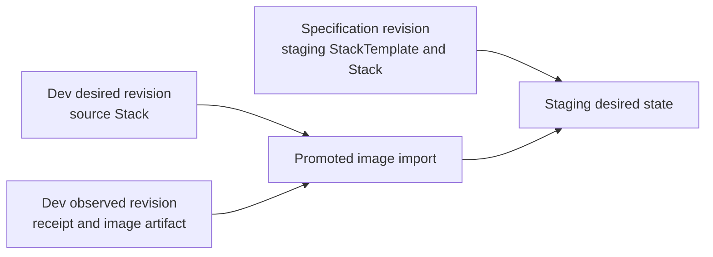

# Kubernetes Stack demo

This demo documents one `StackTemplate` in explicit-input workflows:

- Normal mode applies the `dev` Stack as the authoritative `application` partition, then promotes its exact image
  artifact into the explicitly selected `staging` Stack.
- `--preview` applies an unpartitioned Stack in the `preview` environment. Acceptance also reapplies it at a newer
  source revision, records UID-fenced deletion intent, and runs convergence to progress teardown. Direct delivery
  remains visibly waiting because it has no controller-owned teardown capability; Argo CD delivery can converge once
  the observed Application is gone.

The promotion workflow combines three pinned inputs rather than copying dev's entire desired tree. This demo keeps the
target StackTemplate inline in `deployment/stack-templates/application.yaml` and supplies it explicitly together with
the target Stack. A Stack-only promotion may instead reuse a target StackTemplate already present in target desired
state, but only when no authoritative partition selects it. An authoritative partition must include its complete target
template input. Only the image artifact is selected from dev's pinned desired and observed state:



The target specification revision authenticates the Project/Environment configuration and the exact bytes of explicit
target input files. The source desired and observed revisions provide artifact lineage. This demo uses direct-inline
StackTemplate input; repository-backed `fromGit` and explicit template `fromPromotion` are separate acquisition modes
and are described in [Stacks and StackTemplates](../../docs/apis/stacks.md#acquisition-modes). See [Promotion](../../docs/apis/promotion.md#how-target-desired-state-is-built) and
[Stacks and StackTemplates](../../docs/apis/stacks.md#desired-state-records).

The provider comes from `GITOPSCTR_K8S_PROVIDER` and defaults to `kind`:

```console
mise install
mise run sync
mise run demo-k8s run
mise run demo-k8s acceptance
mise run demo-k8s clean

GITOPSCTR_K8S_PROVIDER=minikube mise run demo-k8s run
```

Inspect the resolved template and its acquisition lineage after a run:

```console
gitopsctr get stacktemplates --environment dev
gitopsctr get stacktemplate application --environment dev -o yaml
```

The runner also prints `gitopsctr get all --environment <environment>` after every successful convergence so each
workflow includes an aggregate desired-and-observed inventory snapshot.

Run the unpartitioned preview workflow with:

```console
mise run demo-k8s run --preview
mise run demo-k8s acceptance --preview
```

Direct Kubernetes delivery is the default. Select Argo CD external delivery with:

```console
mise run demo-k8s run --delivery argocd
mise run demo-k8s acceptance --delivery argocd
mise run demo-k8s acceptance --preview --delivery argocd
mise run demo-k8s clean --delivery argocd
```

The Argo CD mode installs a pinned, headless Argo CD Core instance and an isolated in-cluster Git daemon. The daemon
is unauthenticated and is suitable only for this disposable local demo. Docker must be running; Mise supplies Helm,
kind, minikube, kubectl, Python, and the other project tools.
