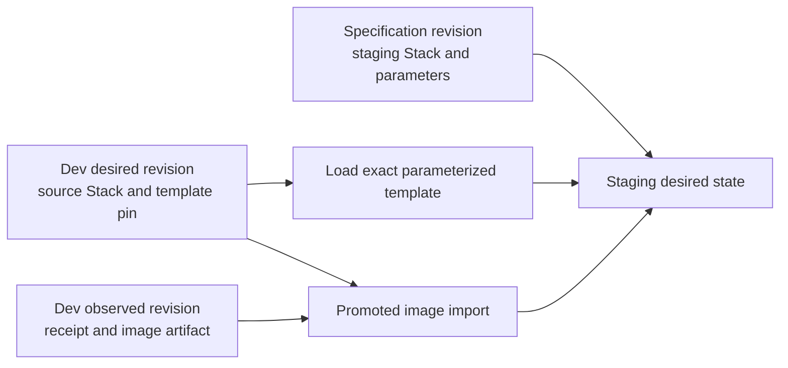

# Kubernetes Stack demo

This demo documents one `StackTemplate` in explicit-input workflows:

- Normal mode applies the `dev` Stack as the authoritative `application` partition, then promotes its exact image
  artifact into the explicitly selected `staging` Stack.
- `--preview` applies an unpartitioned Stack in the `preview` environment. Acceptance also reapplies it at a newer
  source revision and requests UID-fenced deletion.

The deferred promotion workflow combines three pinned inputs rather than copying dev's entire desired tree:



The current direct-inline slice supports the `preview` workflow and direct StackTemplate application. Template
promotion is deferred; the staging example retains its artifact-lineage documentation for the follow-up promotion
slice. See [Promotion](../../docs/apis/promotion.md#how-target-desired-state-is-built) and
[Stacks and StackTemplates](../../docs/apis/stacks.md#desired-state-records).

The provider comes from `GITOPSCTR_K8S_PROVIDER` and defaults to `kind`:

```console
mise install
mise run sync
mise run demo-k8s run
mise run demo-k8s acceptance
mise run demo-k8s clean

GITOPSCTR_K8S_PROVIDER=minikube mise run demo-k8s run
```

Run the unpartitioned preview workflow with:

```console
mise run demo-k8s run --preview
mise run demo-k8s acceptance --preview
```

Direct Kubernetes delivery is the default. Select Argo CD external delivery with:

```console
mise run demo-k8s run --delivery argocd
mise run demo-k8s acceptance --delivery argocd
mise run demo-k8s acceptance --preview --delivery argocd
mise run demo-k8s clean --delivery argocd
```

The Argo CD mode installs a pinned, headless Argo CD Core instance and an isolated in-cluster Git daemon. The daemon
is unauthenticated and is suitable only for this disposable local demo. Docker must be running; Mise supplies Helm,
kind, minikube, kubectl, Python, and the other project tools.
