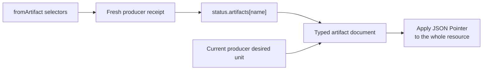

# Artifact resources

Artifact resources are immutable, typed outputs published by unit drivers on the observed ref. A producer writes each
artifact to `artifacts/<unit>/<logical-name>.yaml|json` and records its GVK, path, media type, and digest in the unit's
[Receipt](receipt.md).

The current bundled artifact kinds are:

| Kind | Producer | Logical name | Documentation |
| --- | --- | --- | --- |
| `ContainerImages` | `OciImages` | `containers` | [Container images](container-images.md) |
| `FrontendBundle` | `ViteOciBundle` | `frontend` | [Frontend bundle](frontend-bundle.md) |

Plugins can register additional `artifact.gitopsctr.io` kinds. The table describes the bundled set, not a complete
ecosystem.

## Inspect artifacts

Artifact local identity has two registry-declared segments: `producer/name`. It composes with the Environment scope;
it does not introduce a separate Unit namespace. The qualified name rendered by the table is also the exact lookup
address:

```console
gitopsctr get artifacts --environment dev
gitopsctr get artifacts --environment dev --producer application--image
gitopsctr get artifact application--image/containers --environment dev
```

`get all --environment dev` includes an `ARTIFACTS` section. Inspection authenticates each Artifact through its Receipt
descriptor and the Receipt's exact desired producer before reporting it as `CURRENT`. The producer's authenticated
desired resource supplies the Artifact's partition. The existing Receipt shortcuts remain useful for relationship-first
navigation: `gitopsctr get receipt PRODUCER --environment dev --artifact NAME` or `--artifacts`.

A named query with one result returns the exact Artifact document, matching other `get` selectors. Collection and
aggregate machine queries always use the typed `inspection.gitopsctr.io/v1 ResourceList` contract, even when the
collection contains zero or one item. A named all-Environment query uses the list only if it matches multiple
resources. The list's optional per-item
`inspection.authentication` field is derived inspection state, not part of the persisted Artifact: `CURRENT` means the
Receipt descriptor and exact current desired producer authenticate the Artifact; `STALE` means the descriptor is valid
for an older desired producer; and `ORPHAN` means no matching Receipt/current producer relationship can authenticate it.
Historical inspection may set both the desired and observed ref/revision overrides.

## How `fromArtifact` resolves



```yaml
image:
  fromArtifact:
    unit: application-images
    name: containers
    apiVersion: artifact.gitopsctr.io/v1
    kind: ContainerImages
    pointer: /images/application/uri
```

The lookup first requires a current producer receipt. The driver must declare the logical artifact name and the same
GVK selected by the reference. gitopsctr then follows the receipt descriptor, verifies its required path, media type,
digest, and GVK, parses the registered artifact contract, and checks its producer identity against the current desired
unit. Only then is the pointer applied to the complete artifact resource.

Missing, stale, or integrity-mismatched evidence leaves the consumer waiting. Invalid reference syntax, an unregistered
artifact GVK, or a malformed typed artifact document is an error. The artifact digest is the resolved-input
fingerprint. See [Reference expressions](../references.md) for selector syntax and `dryFallback`.
