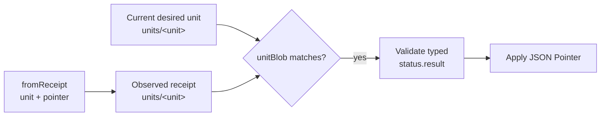

# Receipt

`gitopsctr.io/v1` `Receipt` records the result of reconciling one exact desired unit. The controller and unit driver
write it to `units/<unit>.yaml|json` on the observed ref; users do not author receipts.

```yaml
apiVersion: gitopsctr.io/v1
kind: Receipt
metadata:
  name: infrastructure
spec:
  subject:
    apiVersion: unit.gitopsctr.io/v1
    kind: Terraform
    name: infrastructure
  desired:
    unitBlob: 0123456789abcdef0123456789abcdef01234567
  resolvedInputs: {}
status:
  controller: {}
  result:
    applied:
      sourceRevision: fedcba9876543210fedcba9876543210fedcba98
    outputs:
      api_url: https://api.example.test
```

`spec.subject` identifies the unit kind, `spec.desired.unitBlob` binds the receipt to the serialized desired unit, and
`spec.resolvedInputs` records the reference fingerprints used by that unit. `status.result` follows the subject
driver's typed result contract. Drivers that publish artifacts also add descriptors under `status.artifacts`.

## Receipt and Unit state

A Receipt is a separately stored observed resource, not the `status` field of its desired Unit. The two resources may
come from different Git revisions, and a desired Unit may have a current Receipt, a stale Receipt for an older Unit
blob, or no Receipt. Conversely, deleting a desired Unit can leave an orphaned Receipt in a selected observed
snapshot.

The default Unit table makes this relationship convenient without hiding it:

```console
gitopsctr get units --environment dev
gitopsctr get receipts --environment dev
gitopsctr get unit infrastructure --environment dev -o yaml
gitopsctr get receipt infrastructure --environment dev -o yaml
```

The table derives observation and reconciliation columns by joining the resources. The two YAML commands return the
exact persisted Unit and Receipt documents; neither command synthesizes the Receipt into Unit status. Use
`gitopsctr get receipt infrastructure --environment dev --artifact NAME` for one described Artifact resource, or
`--artifacts` for all of them.

## How `fromReceipt` resolves



For `fromReceipt: {unit: infrastructure, pointer: /outputs/api_url}`, gitopsctr:

1. Loads `units/infrastructure.*` from the current desired and observed trees.
2. Requires the receipt's `spec.desired.unitBlob` to match the current desired unit blob.
3. Validates the receipt and its `status.result` against the Terraform receipt profile.
4. Applies `/outputs/api_url` relative to `status.result` and fingerprints the receipt blob.

A missing or stale receipt leaves the consumer waiting; an invalid current receipt is an error. `pointer: ""` selects
the whole typed result. See [Reference expressions](../references.md) for `dryFallback` and pointer syntax.

The generic [Receipt schema](../schemas/apis/gitopsctr.io/v1/Receipt.schema.json) describes the envelope. Each
[unit kind](../drivers.md) also publishes a receipt profile that specializes `status.result` and `status.artifacts`.
