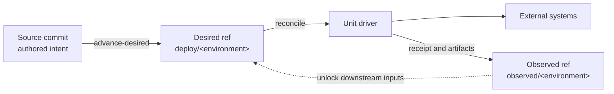
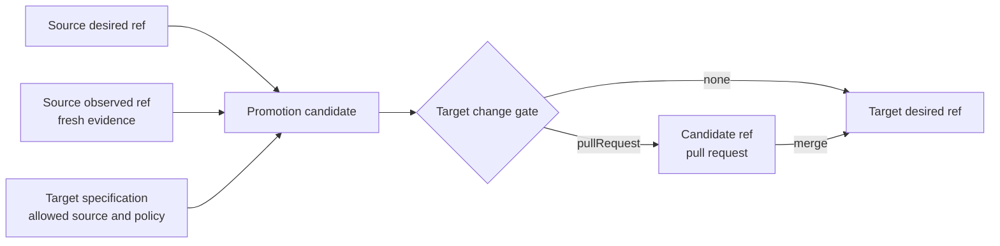

# Concepts

gitopsctr separates authored intent, resolved desired state, and observed evidence. Git records each transition, while
unit drivers perform the external work.

## Resources and units

- A **Project** is one source repository containing project configuration and authored environments.
- An **Environment** selects deployment refs, promotion rules, change gates, and its set of units.
- A **Unit** is a named deployable resource such as an image build, Terraform configuration, or Kubernetes release.
- A **unit driver** implements a unit kind and may support planning, materialization, reconciliation, or verification.
- A **dependency DAG** orders units whose authored values read receipts or artifacts from other units.

The built-in kinds are only the kinds bundled with this distribution. Plugins can register additional unit and
artifact kinds by full group/version/kind. See [Resources and API kinds](documents.md).

## The three Git states

| State | Owner | Typical contents |
| --- | --- | --- |
| Source commit | User | `Project`, authored `Environment` and Unit resources, deployment source files |
| Desired ref | Controller | Fully resolved units and materialized payloads under `deploy/<environment>` by default |
| Observed ref | Controller and drivers | Receipts and artifacts under `observed/<environment>` by default |

An environment may override the desired and observed ref names, but they must remain distinct. Separating them allows
desired state to advance independently while receipts continue to describe the exact desired revision a driver
observed.

## Desired state, receipts, and artifacts

`advance-desired` pins source inputs and resolves available references into an immutable desired unit. A unit is ready
only when all required inputs are available. Materialization-capable drivers may also commit rendered payloads below
`materialized/<unit>/`.

Successful reconciliation writes a **Receipt** to the observed ref. It identifies the exact desired unit blob and
contains the driver's typed result. A receipt is clean only while it still matches the current desired unit; otherwise
it is stale and the unit needs reconciliation.

Drivers may publish typed **artifacts** alongside their receipt, for example a `ContainerImages` resource containing
immutable image URIs. Consumers use [reference expressions](references.md) to read receipt results, artifacts, or a
promoted desired unit. The [Receipt](apis/receipt.md) and [artifact](apis/artifacts.md) API pages show how those lookups
follow the desired and observed trees.

## Advance, reconcile, and converge

- **Advance** resolves every currently ready unit and moves the desired ref when its tree changes.
- **Reconcile** plans or applies one desired unit and publishes its receipt after success.
- **Converge** repeats those operations in dependency order until every selected unit is clean or waiting.
- **Verify** checks supported units for external drift without writing receipts.

Because observations can unlock downstream desired units, one source commit may produce several desired and observed
ref advances before convergence becomes clean.

## Promotion and rollback

A **source-tracked environment** resolves authored units from an explicit source revision. A **promotion-tracked
environment** instead accepts reviewed desired state from one of its configured source environments. Promotion records
the exact source desired, observed, and specification revisions in a controller-owned `Promotion` resource.

`changeGate: pullRequest` publishes promotion and rollback candidates for review; `changeGate: none` publishes them
directly. Promotion normally requires every source unit to have a current receipt. Environments that contain only
materialized units may opt into materialized promotion evidence.

Rollback never rewinds a deployment ref. It validates a historical desired snapshot and publishes a new forward
commit containing the selected historical state, preserving an auditable history.
