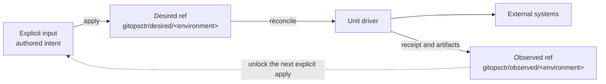
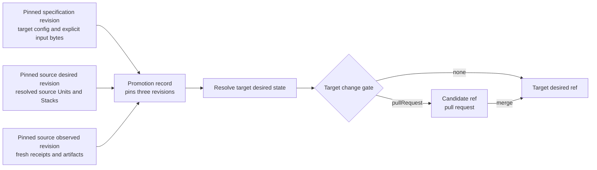

# Concepts

gitopsctr separates authored intent, desired state, and observed evidence. Git
records each transition. Unit drivers perform external work.

> Authored input is a recipe. A desired Unit is an execution snapshot. Desired
> StackTemplates and Stacks are durable projection inputs. Receipts and
> Artifacts are separate observed evidence, not embedded status.



## Resource definitions and instances

- A **Project** is one source repository containing project configuration and authored environments.
- An **Environment** is gitopsctr's namespace boundary. It selects deployment refs, promotion rules, change gates, and
  its set of resources.
- A **Unit** is a named deployable resource such as an image build, Terraform configuration, or Kubernetes release.
- A **unit driver** implements a unit kind and may support planning, materialization, reconciliation, or verification.
- A **dependency DAG** orders units whose authored values read receipts or artifacts from other units.

gitopsctr's resource registry defines these concepts as invariants rather than scattering them through controller and
CLI code. A **resource family definition** gives a kind or interface its CLI selectors. **Placements** say which
source, desired, or observed representations the family can have, their scope, and their logical collection.
**Relationship definitions** describe how separately stored resources relate, such as a Receipt observing a desired
Unit. Persisted YAML or JSON documents are instances of those definitions; the registry does not create an additional
document format.

Local document identity and hierarchical placement are intentionally separate. `metadata.name` is local to the
resource's placement; the registered collection adapter encodes that placement as a hierarchical storage path and
rejects duplicate composite identities. Each family also registers a root, child, or mirror address rule. Those rules
produce the same `qualifiedName` used by storage and accepted by the CLI: roots such as `database`, Stack children such as
`application/image`, mirrored Receipts with the same Unit address, and Artifacts such as
`application/image/containers`. The Environment and family remain separate command context, and partitions are never
address components. The registry validates address dependencies, storage round-tripping, and rejects missing
relationships, ambiguity, and cycles.

The built-in kinds are only the kinds bundled with this distribution. Plugins can register additional Unit and
Artifact kinds by full group/version/kind. A `gitopsctr.resource-models` entry point may contribute collections,
families, relationships, inspection presenters, and address rules; all contributions are merged into and validated by
the same registry, and their selectors automatically appear in `get`. See [Resources and API
kinds](documents.md) for the authoring contracts and the generated [resource model](resource-model.md) for the
authoritative plane and relationship matrix.

## The three storage planes

| Plane | Owner | Typical representations |
| --- | --- | --- |
| Source | User | `Project`, authored `Environment`, Unit, Stack, and StackTemplate resources, plus deployment source files |
| Desired | Controller | Resolved Unit, Stack, StackTemplate, and Promotion representations under `gitopsctr/desired/<environment>` by default |
| Observed | Controller and drivers | Receipt and Artifact resources under `gitopsctr/observed/<environment>` by default |

A resource family may have a representation in more than one plane. For example, Units and Stacks have authored
source and resolved desired representations, while StackTemplates are project-scoped in source and environment-scoped
in desired state. Receipt and Artifact resources live only in the observed plane. Physical Git paths are owned by the
plane's collection adapter; placement is part of the resource definition rather than a controller convention.

An environment may override the desired and observed ref names, but they must remain distinct. Separating them allows
desired state to advance independently while receipts continue to describe the exact desired revision a driver
observed.

## Operations across the planes

| Operation | Reads | Publishes | External effects |
| --- | --- | --- | --- |
| `apply` | Explicit source recipes or canonical desired input | Desired Units, StackTemplates, Stacks, and projections | None |
| `promote` | Target specification plus pinned source desired and observed revisions | Target desired state and a Promotion record | None |
| `rollback` | A historical desired revision | A new forward desired commit | None |
| `delete` | A UID-fenced desired root | Deletion intent in desired state | None |
| `reconcile` | One live desired Unit and observed evidence | Receipts, Artifacts, and deletion cleanup commits | Driver effects or idempotent teardown |
| `converge` | Desired state, observed evidence, and optional explicit input | The desired/observed commits needed to become clean | Dependency-ordered driver effects and teardown |
| `get` / `status` / `validate` | Source, desired, or observed resources | Nothing | None |

The normal state flow is chronological:

1. A user or CI job authors a recipe in the Source plane.
2. `apply` resolves it into Desired state. Desired StackTemplates and Stacks retain projection intent; desired Units
   contain resolved execution snapshots.
3. `reconcile` or `converge` processes desired Units in dependency order. Drivers perform external work and publish
   Receipts and immutable Artifacts in the Observed plane.
4. New observed evidence can unlock a later projection. `converge` re-evaluates durable StackTemplate/Stack inputs
   and atomically advances the affected active projection without rereading unrelated authored input.
5. Deletion follows the same flow: `apply` partition omission or `delete` records intent, then reconciliation tears
   down children first and publishes the fenced cleanup commit automatically.

No candidate or non-live desired ref starts reconciliation or teardown. A change-gated candidate must reach the live
desired ref first.

## Desired state, receipts, and artifacts

`apply` pins source inputs and resolves available references into an immutable desired Unit. A Unit is ready only when
all required inputs are available. Materialization-capable drivers may also commit rendered payloads below
`materialized/<qualified-unit>/`. Repository-backed Unit sources inherit the exact source context retained by their desired
StackTemplate unless an authored `source.revision` selects an exact 40-hex commit. StackTemplate parameters may supply
that override from the same acquired-ref history; it is not a direct-Unit field. The effective revision is persisted
in the structural projection and desired Unit.

Successful reconciliation writes a **Receipt** to the observed ref. A Receipt is a separate observed resource, not a
Unit's embedded `status`. Its subject identifies a desired Unit, and its desired-unit logical entry `ContentId`
identifies the exact Unit document that the driver reconciled. Comparing the separately stored documents derives
whether the observation is current or stale; a Unit can also have no Receipt. Raw Unit output therefore remains the exact desired document, while
the default Unit table can join that document with its Receipt to present operational state.

Drivers may publish typed **artifacts** alongside their receipt, for example a `ContainerImages` resource containing
immutable image URIs. Consumers use [reference expressions](references.md) to read receipt results, artifacts, or a
promoted desired unit. The [Receipt](apis/receipt.md) and [artifact](apis/artifacts.md) API pages show how those lookups
follow the desired and observed trees.

## Apply, reconcile, and converge

- **Apply** resolves explicit input and publishes a changed desired snapshot. A named partition makes those roots an
  authoritative set, enabling omission-based pruning; unpartitioned roots are independently applied.
- **Reconcile** plans or applies one desired unit and publishes its receipt after success.
- **Converge** reconciles current desired Units, or repeats apply and reconciliation when explicit input is supplied.
- **Verify** checks supported units for external drift without writing receipts.

Because observations can unlock downstream desired inputs, convergence with explicit input may produce several
desired and observed commits before it becomes clean. Convergence without input re-projects the durable
StackTemplate/Stack intent after evidence changes, while ordinary standalone authored input still requires an
explicit apply when it changes.

## Promotion and rollback

Promotion applies explicit target resources with pinned context from a permitted source environment. It does not
implicitly copy the source desired tree. The resulting controller-owned `Promotion` resource records the exact source
desired, source observed, and target specification revisions.



In compact form:

```text
target desired state = target specification at specificationRevision
                     + selected inputs from source desiredRevision and observedRevision
```

For example, a target Stack may reuse a StackTemplate already in target desired state, or promotion may supply that
StackTemplate inline, from Git, or with an explicit `source.fromPromotion` selector. The latter resolves only against
the pinned source desired revision; acquisition is never implicit. A StackTemplate's desired acquisition record keeps
the requested and resolved source lineage, while `documentDigest` checks the serialized selected document and
`contentDigest` identifies its semantic inline content. See [Stacks and StackTemplates](apis/stacks.md) for
source-context propagation and [Promotion](apis/promotion.md) for the lineage record.

`changeGate: pullRequest` publishes promotion and rollback candidates for review; `changeGate: none` publishes them
directly. Promotion normally requires every source unit to have a current receipt. Environments that contain only
materialized units may opt into materialized promotion evidence.

Rollback never rewinds a deployment ref. It validates a historical desired snapshot and publishes a new forward
commit containing the selected historical state, preserving an auditable history.
