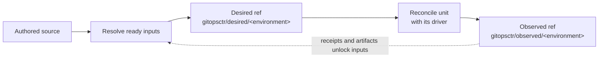

# gitopsctr

gitopsctr is a local-first deployment reconciler. You author environments and units in a source repository.
gitopsctr resolves them into immutable desired-state commits. Typed unit drivers perform external work. Git stores
receipts and artifacts in a separate observed-state history.

Use it when Git must audit deployments without making a long-running controller the only state owner. The same CLI runs
locally and in CI. It promotes clean state, verifies drift, and publishes forward-only rollback commits.

!!! warning "Alpha and actively developed"

    gitopsctr is not yet production-stable. APIs may change before production as the resource model evolves. The
    bundled API kinds are not complete: plugins can register additional unit and artifact kinds.

## Start here

1. Run the [local Docker tutorial](tutorial.md) for a real image-to-Terraform deployment.
2. Read [Concepts](concepts.md) to understand source, desired, and observed Git state.
3. Use [Resources and API kinds](documents.md) when authoring a Project, Environment, or Unit.
4. Follow [Operations](operations.md) for planning, convergence, promotion, verification, and rollback.

The [unit kind overview](drivers.md) lists the built-in drivers. The [JSON Schema catalog](schemas.md) and
`gitopsctr COMMAND --help` define resource fields and CLI flags.

## Install

```console
uv tool install gitopsctr
gitopsctr --help
```

For source development, run `mise install`, `mise run sync`, then `mise run check`.

## Main workflow



Desired state defaults to `gitopsctr/desired/<environment>`; receipts and artifacts default to
`gitopsctr/observed/<environment>`. See
[Concepts](concepts.md) for ownership, freshness, promotion, and rollback semantics.
