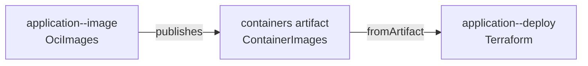

# Local Docker tutorial

This tutorial deploys a real HTTP service without cloud credentials. It uses the repository's Docker demo to build an
OCI image, pass its immutable digest to Terraform, and run the resulting container locally.

!!! note "Run from a source checkout"

    You need Docker and [mise](https://mise.jdx.dev/). The demo creates all mutable state below
    `.docker-demo-state/` and never writes deployment refs to the gitopsctr repository or its remote.

## Inspect the authored project

The demo source is under `demo/docker/repository/`:

- `gitopsctr.yaml` declares the `Project` and its environment directory.
- `deployment/environments/dev/environment.yaml` declares the `dev` environment.
- `deployment/stack-templates/application.yaml` declares reusable image and deployment Unit templates.
- `deployment/environments/dev/stacks/application.yaml` instantiates them as one source-tracked Stack.

The service obtains the immutable image URI from the image unit:

```yaml
image:
  fromArtifact:
    unit: application--image
    name: containers
    apiVersion: artifact.gitopsctr.io/v1
    kind: ContainerImages
    pointer: /images/application/uri
```



This reference creates a dependency: `application--image` must publish its receipt and `containers` artifact before
`application--deploy` can be resolved. Both Units are owned by the `application` Stack.

## Deploy

Install the development tools and start from an empty demo state:

```console
mise install
mise run sync
mise run demo-docker run
```

The runner creates an isolated Git repository, starts a local registry, then runs `converge`. Convergence advances
`gitopsctr/desired/dev`, expands the Stack, reconciles `application--image`, publishes its receipt and artifact to
`gitopsctr/observed/dev`, advances the Stack projection with the resolved image URI, and finally reconciles
`application--deploy`.

The command finishes with the application URL and response. Verify it directly:

```console
curl http://127.0.0.1:18080
```

## Inspect desired and observed state

Change into the demo's isolated repository:

```console
cd .docker-demo-state/repository
uv run gitopsctr status --environment dev
uv run gitopsctr list units --environment dev
uv run gitopsctr show desired --environment dev application--deploy
uv run gitopsctr show receipt --environment dev application--image
uv run gitopsctr show receipt --environment dev application--image --artifact containers
git log --all --oneline --decorate
```

The source commit contains authored resources. `gitopsctr/desired/dev` contains resolved desired units;
`gitopsctr/observed/dev` contains
receipts and artifacts proving what was applied. See [Concepts](concepts.md) for the full state model.

## Source-tracked and directly managed resources

This tutorial uses a source-tracked Stack: source YAML declares the Stack root, and `advance-desired` controls its
lifecycle and that of its generated Units. Preview CI can instead create a directly managed Stack in the desired ref:

```console
gitopsctr create stack --in=state --or-update \
  --environment preview --name pr-123 --template preview \
  --source-revision "$GITHUB_SHA" \
  --request-id "github:example/application#123:sync:$GITHUB_SHA"
```

The command is safe to retry with the same request ID and inputs. A later
source revision is a new mutation and needs a new request ID. Reusing an ID
with different inputs is rejected. See [Preview environments](preview-environments.md)
for deletion and finalization.

## Prove clean convergence

Return to the source checkout and run the demo again:

```console
cd ../..
mise run demo-docker run
```

With unchanged source and external state, no driver runs and neither deployment ref moves. This idempotent second run
is the steady state that `converge` aims for.

Remove the containers, images, registry, isolated Git repository, receipts, and Terraform state when finished:

```console
mise run demo-docker clean
```

The [demo README](https://github.com/NiklasRosenstein/gitopsctr/tree/main/demo/docker) is the concise operational
reference for reruns, acceptance checks, port overrides, and cleanup.
