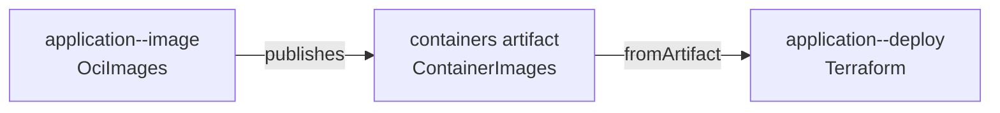

# Local Docker tutorial

This tutorial deploys a real HTTP service without cloud credentials. It uses the repository's Docker demo to build an
OCI image, pass its immutable digest to Terraform, and run the resulting container locally.

!!! note "Run from a source checkout"

    You need Docker and [mise](https://mise.jdx.dev/). The demo creates all mutable state below
    `.docker-demo-state/` and never writes deployment refs to the gitopsctr repository or its remote.

## Inspect the authored project

The demo source is under `demo/docker/repository/`:

- `gitopsctr.yaml` declares the `Project` and its environment directory.
- `deployment/environments/dev/environment.yaml` declares the `dev` environment.
- `deployment/stack-templates/application.yaml` declares reusable image and deployment Unit templates.
- `deployment/environments/dev/stacks/application.yaml` instantiates them as one Stack in the `application` apply
  partition.

The service obtains the immutable image URI from the image unit:

```yaml
image:
  fromArtifact:
    unit: application--image
    name: containers
    apiVersion: artifact.gitopsctr.io/v1
    kind: ContainerImages
    pointer: /images/application/uri
```



This reference creates a dependency: `application--image` must publish its receipt and `containers` artifact before
`application--deploy` can be resolved. Both Units are owned by the `application` Stack.

## Deploy

Install the development tools and start from an empty demo state:

```console
mise install
mise run sync
mise run demo-docker run
```

The runner creates an isolated Git repository, starts a local registry, then runs `converge` with the Stack file and
partition as explicit inputs. Convergence applies the Stack to `gitopsctr/desired/dev`, reconciles
`application--image`, publishes its receipt and artifact to `gitopsctr/observed/dev`, reapplies the same input to
resolve the image URI, and finally reconciles `application--deploy`.

The command finishes with the application URL and response. Verify it directly:

```console
curl http://127.0.0.1:18080
```

## Inspect desired and observed state

Change into the demo's isolated repository:

```console
cd .docker-demo-state/repository
uv run gitopsctr status --environment dev
uv run gitopsctr get environments
uv run gitopsctr get units --environment dev
uv run gitopsctr get stacks --environment dev
uv run gitopsctr get unit application--deploy --environment dev -o yaml
uv run gitopsctr get receipt application--image --environment dev -o yaml
uv run gitopsctr get receipt application--image --environment dev --artifact containers
git log --all --oneline --decorate
```

The source commit contains authored resources. `gitopsctr/desired/dev` contains resolved desired Units, Stacks, and
StackTemplates; `gitopsctr/observed/dev` contains Receipts and Artifacts proving what was applied. The default Unit
table combines those planes into an operational summary, but `-o yaml` returns the exact desired Unit and exact
Receipt as separate resources. See [Concepts](concepts.md) for the full state model.

## Partitions and independent resources

This tutorial applies one authoritative partition. If the Stack is removed from the next application of that
partition, gitopsctr begins deletion of the Stack and its generated Units:

```console
gitopsctr apply --environment dev \
  --partition application \
  --file deployment/environments/dev/stacks \
  --source-revision HEAD
```

Applying without `--partition` updates only explicitly supplied roots. Existing resources keep their partition; new
resources remain unpartitioned. See [Preview environments](preview-environments.md) for the unpartitioned preview
workflow and deletion/finalization.

## Prove clean convergence

Return to the source checkout and run the demo again:

```console
cd ../..
mise run demo-docker run
```

With unchanged source and external state, no driver runs and neither deployment ref moves. This idempotent second run
is the steady state that `converge` aims for.

Remove the containers, images, registry, isolated Git repository, receipts, and Terraform state when finished:

```console
mise run demo-docker clean
```

The [demo README](https://github.com/NiklasRosenstein/gitopsctr/tree/main/demo/docker) is the concise operational
reference for reruns, acceptance checks, port overrides, and cleanup.
